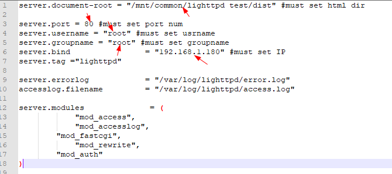

## 环境搭建  
1. 安装VMware-workstation-full-15.1.0+ubuntu18.04.02    
2. 设置`PC本地IP:192.168.1.120`，`v4主板IP：192.168.1.180  `    
3. 交工具链:***gcc-linaro-7.4.1-2019.02-x86_64_aarch64-linux-gnu***  
4. V4主板、串口线、1000M网线等    
5. 安装串口调试工具SecureCRT  
6. 安装tftp32工具    
  
## 下载、编译lighttpd
1. 下载[lighttpd-1.4.35.tar.gz](https://www.lighttpd.net/download/)    
2. 解压lighttpd-1.4.35.tar.gz，并进入lighttpd-1.4.35目录 
```   
$ tar -xzvf lighttpd-1.4.35.tar.gz   
$ cd lighttpd-1.4.13
```
3. 交叉编译  
```  
	$ mkdir ./arch_independent  #lighttpd编译后安装路径，跟在--prefix后面    
	$ ./configure  \         
	--host=aarch64-linux-gnu \  
          --prefix=/mnt/hgfs/ubuntu18_Share/lighttpd-1.4.35/arch_independent \  
	CC=aarch64-linux-gnu-gcc   
	$ sudo make  
	$ sudo make install     
```
## 运行lighttpd
1. 将arch_independent目录下的内容拷贝到一个命名是lighttpd-test的文件夹里。  
```
	$ mkdir  lighttpd-test    
	$ cp -R arch_independent/* lighttpd-test  
```
2. 下载官方[sample.conf](https://www.cyberciti.biz/tips/installing-and-configuring-lighttpd-webserver-howto.html)，并存放在lighttpd-test的文件夹里。  
3. 修改sample.conf，修改处如下图箭头标明处。  

4. 将前端软件源文件dist放进lighttpd-test文件夹。  
5. 压缩lighttpd-test。
```        
	$ tar -cvf lighttpd-test.rar lighttpd-test    
```
6. 将lighttpd-test.rar拷贝到windows下，存放在tftp32文件夹里。
7. 上电主板，linux系统起来后，用tftp工具将lighttpd-test.rar下传到/mnt/common/。  
```
	$ cd /mnt/common  
	$ tftp -g -r lighttpd-test.rar 192.168.1.120  
```
8. 解压lighttpd-test.rar。 
``` 
	$ tar -xvf  lighttpd-test.rar   
```
9. 运行lighttpd。 
``` 
	$ mkdir /var/log/lighttpd  
	$ export LD_LIBRARY_PATH=$LD_LIBRARY_PATH:/mnt/common/lighttpd-test/lib  
	$ cd /mnt/common/lighttpd-test  
	$ ./sbin/lighttpd  -f  ./lighttpd.conf  
```
10. Lighttpd webserver运行后，直接在浏览器上输`http://192.168.1.180:80`即可访问Lighttpd webserver。      
  
	